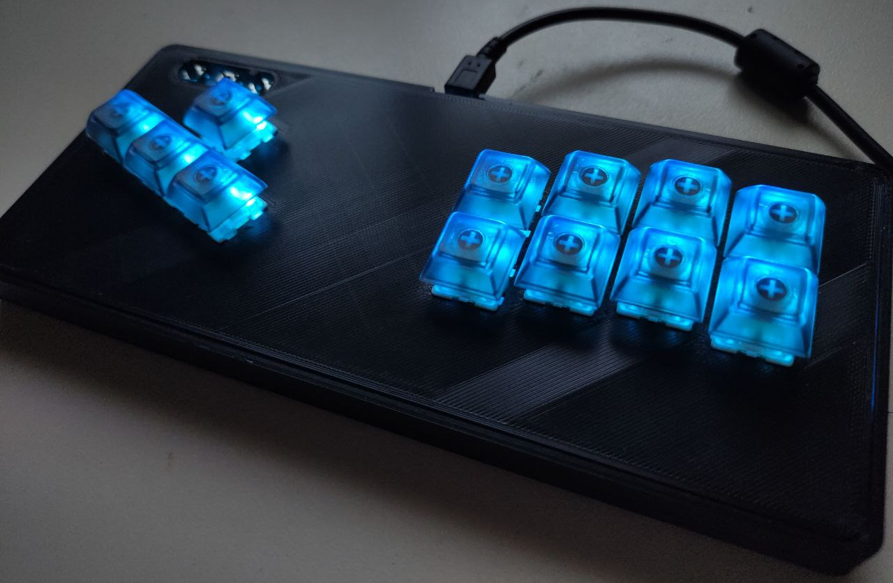

# Zandatsu Fighting Controller v1.0

# Introduction
As my first electronics project and as a fighting game player, I've decided to build this controller.
It's a small Mixbox-style controller running with a Raspberry Pi Pico and GP2040 at its core.
It is using MX-Style switches and Kailh hotswap sockets.

# Credits
- FeralAI and sleepunit for the awesome GP2040 firmware and the help they gave me through this project
- My electronics and physics professor
- Guydog because I wouldn't even have known that the OpenStick Discord server and GP2040 existed without him
- The OpenStick Discord for the feedback
